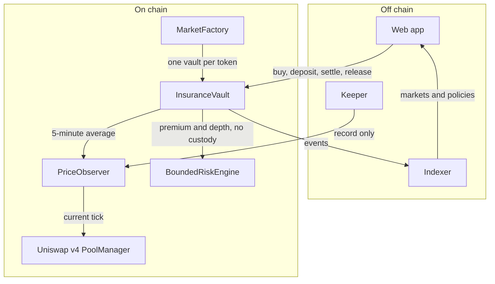

# Paraape

[](https://hackquest.io/en/hackathons/Arbitrum-Open-House-Singapore-Online-Buildathon)

**Chain:** Robinhood Chain testnet (chain ID 46630), an Arbitrum Orbit chain

Hold the memecoin. Name the crash. If it falls that far, you get paid in USDG.

Paraape is on-chain cover for a bag you keep. A buyer pays USDG against one token. If the 5-minute average is still down by the drop they named, the policy pays USDG. Underwriters deposit only USDG, behind one token and one drop. A crash in one coin cannot spend the capital backing another.

- Live app: [paraape.xyz](https://paraape.xyz)
- Docs: [docs.paraape.xyz](https://docs.paraape.xyz)
- Spec: [docs/PRD.md](docs/PRD.md)

---

## Project summary

A holder picks how far the price has to fall, for how long, and how much USDG they want back. They pay a premium and keep the coins. About 30 minutes later the cover turns on. If the drop is still there before expiry, anyone can settle and USDG is reserved. Two hours after that, the buyer can take the payout.

There is no claim form. The contract checks the average, the bag, and the last samples.

---

## Problem

Memecoins are most of the volume on Robinhood Chain. They trade in Uniswap v4 pools. Launchpads lock the liquidity, so the old "pull the LP" rug is mostly gone. What is left is an insider selling a large bag into the pool until the price collapses.

- Scanners warn you before the fact. They do not pay you if you stayed in the coin.
- Market-loss insurance elsewhere excludes the crash itself.
- A spot print can be gamed. v4 pools on this chain do not ship a TWAP, and launchpad hooks are fixed at creation, so an oracle cannot be added to the pool later.

Paraape pays the holder who still holds the bag, from USDG that underwriters posted against that token only.

---

## Solution

**Buyers** keep the memecoin and pay USDG for cover. **Underwriters** deposit USDG behind one coin and collect premiums. If the named crash is still there, the underwriters pay the buyer. If it is not, they keep the premium.

|               |                                                                          |
| ------------- | ------------------------------------------------------------------------ |
| Settlement    | USDG, 6 decimals                                                         |
| Drops         | 50, 60, 70, 80, 90, 95 percent from the entry average                    |
| Terms         | 1, 3, 7, 14, or 30 days                                                  |
| Price         | Sampled 5-minute average from that coin's own pool                       |
| Activation    | About 30 minutes after purchase. The entry is the average at that moment |
| Payout window | 2 hours after settle. A backing LP can challenge                         |

What the app does:

- **Protect.** Paste a token. Pick the drop, the term, and the payout. Pay USDG. Keep the coins.
- **Underwrite.** Deposit USDG into one severity cell. A locked pool with no market yet can be opened from the same screen.
- **Dashboard.** Cover you bought, USDG you deposited, settle, challenge, and release.

A pump after you buy does not raise the entry. A wick that recovers does not pay. A slow bleed to the same drop pays the same as a fast dump, if the drop is still there when someone settles. Selling the bag makes settle revert.

After settle, USDG sits for 2 hours. A liquidity provider who actually backed that cell can challenge. The contract rechecks the average, the persistence of the drop, and the holding. A failed recheck voids the policy and returns the capital. A recheck that still holds charges a spam fee and leaves the payout in place. When the window ends, the buyer calls release.

The shipped keeper only records prices. It does not settle or release. Anyone can settle.

---

## Architecture



Chainlink ETH/USD is consulted only when the pool is quoted in WETH. A USDG-quoted pool does not use it.

| Contract               | Role                                                                                                                                               |
| ---------------------- | -------------------------------------------------------------------------------------------------------------------------------------------------- |
| `MarketFactory`        | Permissionless `createMarket` after the pool exists, the quote is USDG or WETH, and a lock adapter attests the liquidity is locked and deep enough |
| `InsuranceVault`       | Cells, policies, premium, settle, challenge, release. One vault per token                                                                          |
| `PriceObserver`        | Sampled TWAP ring buffer. Anyone may record                                                                                                        |
| `V4PoolTickSource`     | Current tick from the PoolManager                                                                                                                  |
| `BoundedRiskEngine`    | Caps the premium. This is the address vaults call. It wraps `ParaapeRiskEngine`                                                                    |
| `ParaapeRiskEngine`    | Premium, realized vol, and depth. No custody                                                                                                       |
| `ParaapeTestnetLocker` | Testnet lock attestation                                                                                                                           |

LPs share a cell per severity. A milder cell can also back a deeper policy. Fill uses the strictest cell first. Collateral is 1:1 with the payout. Premium streams from activation to expiry. A new factory does not upgrade vaults that already exist.

The Rust twin in `apps/contracts-stylus` mirrors the premium and depth math and holds no funds. New Stylus activations are paused on this chain, so live vaults call the Solidity engine through `BoundedRiskEngine`. When activation is open, the same wrapper can point at the Stylus program without changing the vault.

---

## Tech stack

| Layer     | Tech                                                                            |
| --------- | ------------------------------------------------------------------------------- |
| App       | Next.js 16, React 19, Tailwind CSS 4, Wagmi, Reown AppKit, viem, TanStack Query |
| Docs      | Fumadocs on Next.js                                                             |
| Contracts | Foundry, Solidity 0.8.30, Uniswap v4                                            |
| Risk math | Solidity `ParaapeRiskEngine`, plus a Stylus program in Rust                     |
| Indexer   | Ponder 0.17                                                                     |
| Keeper    | TypeScript, viem. Records ticks. Does not settle                                |
| Repo      | pnpm 11.25.0, Turborepo, Node 24+                                               |

---

## Arbitrum stack

- **Orbit.** Robinhood Chain testnet is an Arbitrum Orbit chain. The memecoin flow this protocol covers already trades there.
- **Uniswap v4 on that chain.** Cover reads the PoolManager. It does not use an off-chain price index.
- **Sampled oracle.** `PriceObserver` stores a ring buffer in the same shape as the Uniswap v3 oracle, because these v4 pools have no built-in TWAP and their hooks cannot be replaced after launch.
- **Stylus.** The premium and depth math is written again in Rust for Stylus. The live path is Solidity until Stylus activation is open. `BoundedRiskEngine` is the swap point.
- **Chainlink.** ETH/USD is used only to turn a WETH quote into USDG.

---

## Repository

```
.
├── apps/
│   ├── web/                  # Protect, Underwrite, Dashboard
│   ├── docs/                 # Public docs
│   ├── contracts-solidity/   # Vault, factory, oracle, risk engine, tests
│   ├── contracts-stylus/     # Rust twin of the risk math
│   ├── indexer/              # Ponder
│   └── keeper/               # Price recorder
├── docs/PRD.md               # Engineering spec
├── package.json
├── pnpm-workspace.yaml
└── turbo.json
```

| Path                                                         | README              |
| ------------------------------------------------------------ | ------------------- |
| [apps/web](apps/web/README.md)                               | Product app         |
| [apps/docs](apps/docs/README.md)                             | Public docs         |
| [apps/contracts-solidity](apps/contracts-solidity/README.md) | Contracts and tests |
| [apps/contracts-stylus](apps/contracts-stylus/README.md)     | Stylus twin         |
| [apps/indexer](apps/indexer/README.md)                       | Index               |
| [apps/keeper](apps/keeper/README.md)                         | Recorder            |
| [docs/PRD.md](docs/PRD.md)                                   | Spec                |

---

## Setup

Node 24 or newer. pnpm 11.25.0.

```bash
pnpm install
pnpm --filter web dev       # http://localhost:3000
pnpm indexer:dev            # http://127.0.0.1:42069
pnpm keeper                 # records prices; does not settle
pnpm contracts:test
pnpm --filter docs dev      # http://localhost:3001
```

Each app has its own README and `.env.example`. Do not commit `.env` files. The browser never sees the RPC URL. It calls `/api/rpc` on the web app.

`apps/web/.env` needs a Robinhood testnet RPC, the factory, the locker, the PoolManager, USDG, and a Reown project id. Quotes, balances, and transactions are read from the chain. The market list and policies come from the indexer. `INDEXER_PROXY_URL` is where `/api/indexer` forwards. For local dev that is `http://127.0.0.1:42069`.

Contracts, from `apps/contracts-solidity`:

```bash
forge test
forge script script/DeployParaape.s.sol:DeployParaape \
  --rpc-url robinhood_testnet --broadcast -vv
```

Leave `STYLUS_RISK_ENGINE` empty so the Solidity engine is deployed. Shell exports override the Foundry dotenv. Unset `FACTORY_ADDRESS`, `LOCKER_ADDRESS`, and `STYLUS_RISK_ENGINE` before a script if an old shell still has them. A new `DeployParaape` does not upgrade vaults from an older factory.

---

## How to use

Testnet USDG, PAPE, and FRESH can be minted from the wallet menu on [paraape.xyz](https://paraape.xyz). `DemoToken.mint` is public. Use Robinhood Chain testnet.

### Buy cover

1. Connect a wallet on chain ID 46630.
2. Open **Protect**. Paste a token that already has a market, or use $PAPE.
3. Pick the drop and the term. Set the USDG payout.
4. Pay the premium. The coins stay in the wallet.
5. Cover turns on about 30 minutes later. The entry average is fixed then.

Buy from a wallet that is not the LP for that cell. The buyer must still hold the covered tokens at settle.

### Underwrite

1. Open **Underwrite**.
2. Pick a token and a drop. Deposit USDG.
3. A locked pool with no vault yet calls `createMarket` from the same flow.
4. Premiums stream to the cell if the named crash does not pay out.

### Settle, challenge, release

1. On **Dashboard**, settle once the 5-minute average is still down by the named drop and the cover is active.
2. USDG is reserved for 2 hours.
3. A backing LP can challenge in that window. The contract rechecks. A failed recheck voids the policy.
4. After the window, the buyer releases the USDG.

The keeper has to be recording that pool or the average cannot move. It never calls settle.

---

## Deployment

Current Paraape deployment on Robinhood Chain testnet. Factory created in block 128515333. A new `DeployParaape` replaces these. The contract name opens that address on the [testnet explorer](https://explorer.testnet.chain.robinhood.com).

| Contract                                                                                                                  | Address                                      |
| ------------------------------------------------------------------------------------------------------------------------- | -------------------------------------------- |
| [MarketFactory](https://explorer.testnet.chain.robinhood.com/address/0xfd748C5571D31d37C7daC77eB74CC5B23964F794)          | `0xfd748C5571D31d37C7daC77eB74CC5B23964F794` |
| [BoundedRiskEngine](https://explorer.testnet.chain.robinhood.com/address/0xC3dF6148B9D05723e9D5d27cc6F972B347F3B38e)      | `0xC3dF6148B9D05723e9D5d27cc6F972B347F3B38e` |
| [ParaapeRiskEngine](https://explorer.testnet.chain.robinhood.com/address/0xEB21A19766A08a60ac001f9dB6AcF3cEdC429d2e)      | `0xEB21A19766A08a60ac001f9dB6AcF3cEdC429d2e` |
| [PriceObserver](https://explorer.testnet.chain.robinhood.com/address/0xDA5eD57F4d8Da626a7f36270FD32989D18712295)          | `0xDA5eD57F4d8Da626a7f36270FD32989D18712295` |
| [V4PoolTickSource](https://explorer.testnet.chain.robinhood.com/address/0x044321A7df3E33d4115ed99F98f2913E1204eea1)       | `0x044321A7df3E33d4115ed99F98f2913E1204eea1` |
| [V4ChainlinkPriceSource](https://explorer.testnet.chain.robinhood.com/address/0x25fc9a901FcfB7A44E748015D8702E205ba2A9E9) | `0x25fc9a901FcfB7A44E748015D8702E205ba2A9E9` |
| [ParaapeTestnetLocker](https://explorer.testnet.chain.robinhood.com/address/0xF3CebAff9C50a7B8b6d5C6d8EC611BD42800CD22)   | `0xF3CebAff9C50a7B8b6d5C6d8EC611BD42800CD22` |
| [VaultDeployer](https://explorer.testnet.chain.robinhood.com/address/0x39729b2a79E03210fdb0B4A47CbA96B577E20c75)          | `0x39729b2a79E03210fdb0B4A47CbA96B577E20c75` |
| [V4LiquidityRouter](https://explorer.testnet.chain.robinhood.com/address/0x8C2fB538299012dA7F51b03b4719997Fc950bb62)      | `0x8C2fB538299012dA7F51b03b4719997Fc950bb62` |
| [PoolManager](https://explorer.testnet.chain.robinhood.com/address/0x8366a39CC670B4001A1121B8F6A443A643e40951)            | `0x8366a39CC670B4001A1121B8F6A443A643e40951` |
| [USDG](https://explorer.testnet.chain.robinhood.com/address/0x6BacC0Ee1F503f7f8c2D2cED742A115DaFE7dDA6)                   | `0x6BacC0Ee1F503f7f8c2D2cED742A115DaFE7dDA6` |
| [$PAPE](https://explorer.testnet.chain.robinhood.com/address/0x1a01888A1E8a5483EbdA9a5bc0A853d9F1DD7C0b)                  | `0x1a01888A1E8a5483EbdA9a5bc0A853d9F1DD7C0b` |
| [$PAPE vault](https://explorer.testnet.chain.robinhood.com/address/0x91e14133E46314aCe0161e5D31298A34643ef638)            | `0x91e14133E46314aCe0161e5D31298A34643ef638` |
| [$FRESH](https://explorer.testnet.chain.robinhood.com/address/0x2cEf7707f0e87BA1010259AEe3A12FD0c88E35C1)                 | `0x2cEf7707f0e87BA1010259AEe3A12FD0c88E35C1` |

Vaults call `BoundedRiskEngine`. The same list, with the rule write-up, is on [docs.paraape.xyz](https://docs.paraape.xyz).

- App: [paraape.xyz](https://paraape.xyz)
- Docs: [docs.paraape.xyz](https://docs.paraape.xyz)

This testnet build is not an audit. Cover here is contract behavior on testnet USDG.

---

## Demo assets

|             |                                              |
| ----------- | -------------------------------------------- |
| Live app    | [paraape.xyz](https://paraape.xyz)           |
| Docs        | [docs.paraape.xyz](https://docs.paraape.xyz) |
| Pitch video | [YouTube](https://youtu.be/zDQDoKbsViI)      |

---

## Team

| Member                | Role                  | Contact                     |
| --------------------- | --------------------- | --------------------------- |
| _Tegar Aji Kurniawan_ | _Fullstack Developer_ | [X](https://x.com/demigohu) |

---

## Open House Buildathon

Built for the [Arbitrum Open House Singapore online buildathon](https://hackquest.io/en/hackathons/Arbitrum-Open-House-Singapore-Online-Buildathon), run by HackQuest for the Arbitrum Foundation. September 14 to October 4, 2026.

The submission is deployed on Robinhood Chain, which the buildathon lists as a qualifying Arbitrum chain alongside Arbitrum One and Arbitrum Sepolia. Contracts are Solidity. The Stylus program is in the repo for the same math.

|              |                                                                                                            |
| ------------ | ---------------------------------------------------------------------------------------------------------- |
| Hackathon    | [HackQuest event page](https://hackquest.io/en/hackathons/Arbitrum-Open-House-Singapore-Online-Buildathon) |
| Program      | [Open House](https://openhouse.arbitrum.io/)                                                               |
| Announcement | [Arbitrum Foundation](https://blog.arbitrum.foundation/open-house-singapore-applications-are-now-open/)    |

Judging looks at innovation, technical implementation, use of the Arbitrum stack, impact, and presentation. The pieces above are the implementation: an isolated USDG vault per token, a v4-sampled oracle, a challenge that rechecks the chain, and a Stylus twin of the risk math.
