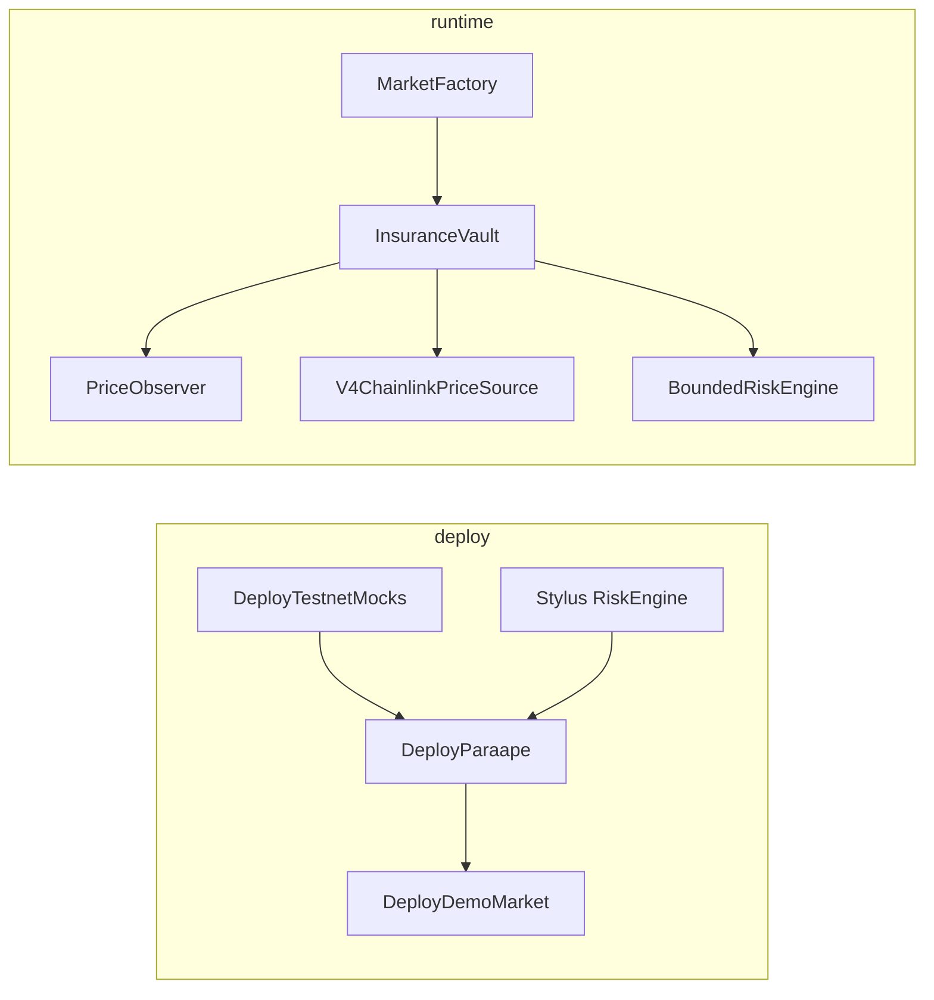

# Paraape — Solidity contracts

On-chain rug insurance for Uniswap v4–style pools on Robinhood Chain. Product spec: [docs/PRD.md](../../docs/PRD.md).

## What lives here

| Area | Path | Role |
| --- | --- | --- |
| Core | `src/MarketFactory.sol`, `src/InsuranceVault.sol` | Permissionless markets, risk cells, policies, settlement |
| Oracle | `src/oracle/PriceObserver.sol`, `V4PoolTickSource.sol`, `V4PriceSource.sol`, `V4ChainlinkPriceSource.sol` | Sampled TWAP on insured pool; WETH→USDG via v4 pool or Chainlink |
| Risk | `src/risk/BoundedRiskEngine.sol`, `ParaapeRiskEngine.sol` | Solidity fallback engine; production wraps Stylus (`STYLUS_RISK_ENGINE`) |
| Locks | `src/adapters/ParaapeTestnetLocker.sol`, `PonsLockAdapter.sol` | Testnet attestation vs mainnet registrar stub |
| Testnet | `src/testnet/*`, `script/Deploy*.s.sol` | Mock USDG/Chainlink, demo pool + market |
| Tests | `test/` | Factory, vault lifecycle, oracle, Chainlink source, risk |

Off-chain risk math twin: [apps/contracts-stylus](../contracts-stylus/README.md).

## Architecture (testnet stack)



Settlement uses **TWAP samples on the insured pool** (`PriceObserver`), not Dexscreener/GMGN. Chainlink is only for converting **WETH-quoted** pools to USDG; USDG/meme demo pools use passthrough quoting.

## Prerequisites

- [Foundry](https://book.getfoundry.sh/getting-started/installation) (`forge`, `cast`) — add `~/.foundry/bin` to `PATH` if needed
- Git submodules for `lib/` (see below)
- Robinhood Chain testnet RPC (chain ID **46630**)

## First-time setup

```bash
cd apps/contracts-solidity
git submodule update --init --recursive   # forge-std, OpenZeppelin, v4-core
cp .env.example .env                      # never commit .env
```

Fill `.env` from `.env.example`. **Do not commit** `.env` or `cache/` (Forge stores sensitive broadcast metadata there).

## Build & test

```bash
forge build
forge test
# or from repo root: pnpm --filter @paraape/contracts-solidity test
```

## Environment variables

| Variable | Required when | Notes |
| --- | --- | --- |
| `ROBINHOOD_TESTNET_RPC_URL` | Deploy / fork | Also referenced in `foundry.toml` as `robinhood_testnet` |
| `PRIVATE_KEY` | Deploy | Testnet deployer only |
| `USDG_ADDRESS` | `DeployParaape`, `DeployDemoMarket` | Paxos USDG on testnet, or mock from `DeployTestnetMocks` |
| `CHAINLINK_ETH_USD_FEED` | WETH markets (recommended) | Mock feed from `DeployTestnetMocks`; set `WETH_USDG_POOL_ID=0x0` |
| `POOL_MANAGER_ADDRESS` | `DeployParaape` | Robinhood v4 PoolManager (see PRD §15) |
| `WETH_ADDRESS` | Chainlink price source | Default in `.env.example` |
| `WETH_USDG_POOL_ID` | Optional | Non-zero if quoting WETH/USDG via v4 instead of Chainlink |
| `WETH_IS_CURRENCY0` | Chainlink path | Default `true` |
| `STYLUS_RISK_ENGINE` | Recommended | Deploy Stylus once; omit to use `ParaapeRiskEngine` only |
| `GUARDIAN_ADDRESS` | Optional | Defaults to deployer |
| `FACTORY_ADDRESS`, `LOCKER_ADDRESS`, `V4_ROUTER_ADDRESS` | `DeployDemoMarket` | Output of `DeployParaape` |
| `DEMO_POOL_USDG` | Optional | 6 decimals; default `10000000` (= 10 USDG). Not `1e15`. |
| `MOCK_USDG_MINT`, `MOCK_ETH_USD_8DEC` | Mocks script | Defaults: 10M USDG units, $3000 ETH (8 decimals) |

After mocks deploy, paste logged addresses into `.env` before running `DeployParaape`.

## Testnet deploy sequence

Use one wallet with testnet USDG (faucet) or mock mint. Order matters.

**0. Stylus risk engine (once per Rust change)**

See [contracts-stylus README](../contracts-stylus/README.md). Set `STYLUS_RISK_ENGINE` in `.env`.

**1. Mock settlement tokens (optional but recommended for full redeploy)**

```bash
source .env  # or: set -a && source .env && set +a
forge script script/DeployTestnetMocks.s.sol:DeployTestnetMocks \
  --rpc-url robinhood_testnet --broadcast
```

Update `USDG_ADDRESS` and `CHAINLINK_ETH_USD_FEED` from console output.

**2. Core protocol**

```bash
forge script script/DeployParaape.s.sol:DeployParaape \
  --rpc-url robinhood_testnet --broadcast
```

Save `FACTORY_ADDRESS`, `LOCKER_ADDRESS`, `V4_ROUTER_ADDRESS`, observer, price source, and risk engine from logs.

**3. Demo meme market (optional)**

Requires `USDG_ADDRESS`, `FACTORY_ADDRESS`, `LOCKER_ADDRESS`, `V4_ROUTER_ADDRESS`, and enough USDG for `DEMO_POOL_USDG`.

```bash
forge script script/DeployDemoMarket.s.sol:DeployDemoMarket \
  --rpc-url robinhood_testnet --broadcast
```

**4. Move mock ETH/USD price (testing only)**

```bash
forge script script/SetMockEthUsd.s.sol:SetMockEthUsd \
  --rpc-url robinhood_testnet --broadcast
```

### Operational notes

- **Keeper**: `createMarket` triggers an initial oracle record; ongoing samples via vault txs, manual `recordPool`, or the Node bot in [`apps/keeper`](../keeper/README.md) (VPS/systemd).
- **Buying policies**: LP/token deployer cannot buy on the same market; use a **second wallet** for `purchasePolicy`.
- **Locker**: testnet uses `ParaapeTestnetLocker` attestation; mainnet targets Pons / pools.trade (`PonsLockAdapter` is a stub).
- **Broadcast artifacts**: `broadcast/**/run-latest.json` may be committed for reproducibility; timestamped `run-*.json` files are gitignored.

## ABI for frontend

```bash
forge inspect src/MarketFactory.sol:MarketFactory abi > ../web/src/abi/MarketFactory.json
forge inspect src/InsuranceVault.sol:InsuranceVault abi > ../web/src/abi/InsuranceVault.json
```

## Layout

```
apps/contracts-solidity/
├── src/           # Protocol contracts
├── script/        # Foundry deploy scripts
├── test/          # Forge tests + fixtures
├── lib/           # Git submodules (forge-std, OZ, v4-core)
├── foundry.toml
├── .env.example   # Template only
└── package.json   # pnpm scripts: build, test
```

## Security

These contracts are under active development for testnet demos. Before mainnet: review oracle staleness, lock adapter integration, economic parameters in `ProtocolConfig`, and external audit scope in the PRD.
