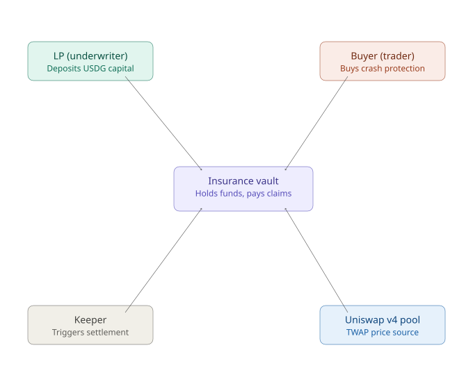
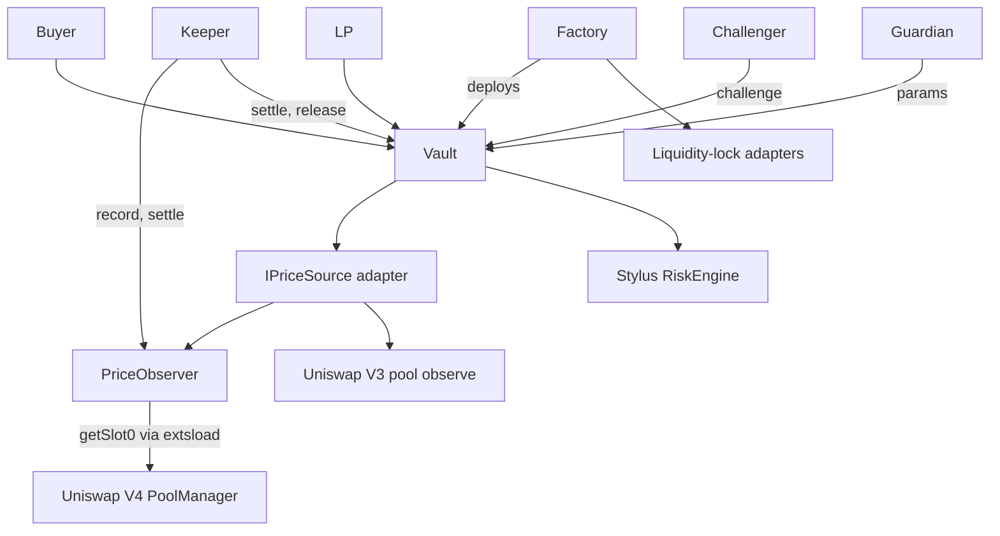

# PRD: Paraape — On-Chain Rug-Pull Insurance

**Product:** Paraape
**Chain:** Robinhood Chain Testnet (chain ID 46630) for the hackathon; Robinhood Chain mainnet (4663) after audit
**Settlement asset:** Paxos USDG only
**Hackathon:** Arbitrum Open House Singapore — Online Buildathon
**Status:** Draft v2 (supersedes v1; decisions in this version are fixed for the smart-contract build)

---

## 1. Problem Statement

Memecoin trading dominates Robinhood Chain activity (~79% of DEX volume). Memecoins launch through Pons and pools.trade and trade on Uniswap V4 pools on the shared PoolManager. Rug pulls — sudden, catastrophic crashes driven by insiders — are a well-documented, industrialized threat in this market.

Both major launchpads permanently lock pool liquidity, so the classic "pull the LP" rug is largely gone. What remains is the **insider dump**: the creator or a cluster of bundled wallets sells a large supply into the pool and the price collapses in minutes.

Existing tools (RugCheck, Veritas Protocol, Elliptic, ScanHood, GeckoTerminal Rug Checker) only **detect and warn** before the fact. None of them **compensate** a trader who gets rugged anyway. Existing crypto insurance protocols (Nexus Mutual, InsurAce, Cork Protocol) explicitly exclude market losses.

**Gap:** no live protocol offers purchasable, automatically settled protection against rug-style crashes, isolated per token, on a permissionless basis.

---

## 2. Positioning

Paraape insures a held bag against a drop of at least **−X% from the price when the policy turns on**, any time before it expires.

- The buyer picks the depth (−50% … −95%) and how long the policy stays on (1–30 days). They do not pick a crash window.
- A slow bleed to −X% pays the same as a fast dump, as long as the drop is still there when someone settles. A wick that recovers does not pay.
- The reference is a 5-minute TWAP at activation, not a spot print and not a later local high. A pump after purchase does not raise the entry.
- The payout never exceeds the loss from that entry, and never exceeds the coverage purchased (Section 7).

---

## 3. Target Users

| User | Who they are | What they want |
| --- | --- | --- |
| **Buyer (trader)** | Retail memecoin trader on Robinhood Chain who holds a specific token | Cheap, automatic protection against being rugged, with no claim form and no trusted claims desk |
| **LP (underwriter)** | Holder of idle USDG, comfortable with defined, isolated risk | Yield above passive lending, with full control over which token and which risk profile they underwrite |

---

## 4. Core Design Decisions

Each decision exists because a simpler version was considered and broke.

### 4.1 Trigger: −X% from the entry TWAP, any time before expiry

- **Rejected:** "price drops X% inside a 5-minute window" — buyers cannot tell whether a rug will finish inside five minutes, and a slow bleed to −90% pays nothing.
- **Rejected:** "malicious on-chain event detected" — duplicates free scanners and is easy to evade.
- **Rejected:** a raw spot print at purchase — one swap can mark the entry.
- **Chosen:** the policy pays when the 5-minute TWAP is at least `s` below the 5-minute TWAP that ended at `activeFrom`, the buyer still holds the bag, and the last K observations are still that far down. Formal definition in Section 6.

### 4.2 Price source: Paraape's own sampled TWAP, behind a price-source adapter

- Uniswap V4 has no built-in price history. Price history in V4 only exists if the pool was created with an oracle hook.
- Pons pools use `PonsV2MemeHook` (fee collection only) and pools.trade pools use no hook. A pool's hook is fixed at creation, so neither can be given an oracle afterwards.
- Paraape therefore runs its own **`PriceObserver`**. It reads each pool's current price from the PoolManager (`StateLibrary.getSlot0`, via `extsload`) and stores observations in the same format as the Uniswap V3 oracle (`tickCumulative`, ring buffer, `observe(secondsAgos)`).
- Market logic depends only on an `IPriceSource` interface. Two concerns are separated:
  - **Insured-token price (rug trigger):** always from `PriceObserver` TWAP on the meme pool (Sections 6, 9.1). Not Chainlink, not off-chain indexers (GMGN/Dexscreener).
  - **Quote → USDG conversion:** when the pool quote asset is WETH, convert to settlement USDG via **`V4ChainlinkPriceSource`** and a Chainlink **ETH/USD** feed (`AggregatorV3Interface`). Testnet uses Chainlink's **`MockV3Aggregator`**; mainnet uses the official Robinhood feed proxy from [Chainlink price feeds](https://docs.chain.link/data-feeds/price-feeds/addresses?network=robinhood) — same adapter, different address, no logic change.
- MVP `IPriceSource` implementations:
  - **`V4ChainlinkPriceSource`** (recommended): meme TWAP + Chainlink ETH/USD for WETH quotes.
  - **`V4PriceSource`**: meme TWAP + optional WETH/USDG **pool** TWAP fallback when no Chainlink feed is configured.
  - **V3 adapter**: pool native `observe()`, only if Uniswap V3 is available on the target chain.

Details in Section 9.

### 4.3 Single-sided USDG, isolated per token

- LPs deposit **only USDG**, never the insured token.
- Every token has its **own isolated market**. A rug on Token A never touches LPs underwriting Token B.
- Market creation is permissionless (Section 9.4).

### 4.4 LP risk cells (severity tiers)

- LPs choose one **severity** tier: "I pay if price is down at least this much from the buyer's entry." There is no crash-speed window.
- Choices are the fixed severity points in Section 5, so liquidity stays in a few pools buyers can actually fill.
- All LPs on the same severity share one **risk cell**: a USDG pool with share-based (ERC-4626-style) accounting.
- The buyer's **duration** (how long the policy stays on) is not an LP axis. It only sets expiry and the premium.

### 4.5 Matching: milder tiers can back stricter policies

A cell may back a policy only if the policy needs a drop **at least as deep** as the cell agreed to pay:

```
cell can back policy  <=>  policy.severity >= cell.severity
```

A −90% policy pays less often than a −50% policy, so −50% liquidity can back it. −90% liquidity cannot back a −50% policy, because that LP did not agree to pay on a smaller drop.

- A policy may be filled from **several eligible cells**. Fill order is strictest cell first, so wide-appetite LPs stay available for milder policies.
- The buyer sets a `minCoverage`. If eligible cells cannot supply at least that much, the purchase reverts.
- Deeper triggers are cheaper. Buyers trade off how far price must fall against the premium.

Example with cell A = −90% and cell B = −70%:

| Buyer request | A eligible | B eligible | Result |
| --- | --- | --- | --- |
| −90% | Yes | Yes | Filled from A, then B |
| −80% | No | Yes | Filled from B |
| −60% | No | No | No coverage |

### 4.6 Full collateralization

All policies on one token trigger together in a rug; the risk is perfectly correlated. Every USDG of coverage is therefore locked 1:1 from LP capital for the life of the policy. There is no leverage and no fractional reserve. LP yield equals premiums divided by locked capital.

### 4.7 Pricing in Stylus

Premiums and LP APY estimates are computed by the **Stylus risk engine** from realized volatility, the policy parameters, and cell utilization (Section 10). LP-set markups are deferred to V2; the cell ID leaves room for a `rateTier` dimension so this can be added without migration.

### 4.8 Continuous insurable interest

A buyer can only insure a token they hold, and must keep holding it. The balance is checked at purchase and again at settlement; a balance below the covered amount at settlement voids the policy (Section 8, layer 1). This keeps the product on the insurance side of the line, compensating a real position rather than enabling a directional bet.

### 4.9 USDG only

All premiums, deposits, and payouts are denominated in Paxos USDG (6 decimals). Other stablecoins are out of scope.

---

## 5. Parameter Grid

### 5.1 Severity levels

`{50, 60, 70, 80, 90, 95}%` below the entry TWAP. The maximum is 95%, because a TWAP almost never reaches exactly zero and a 100% trigger would never pay. LPs deposit into one of these tiers. Buyers buy one of them.

### 5.2 Policy duration

`{1d, 3d, 7d, 14d, 30d}`. Duration is how long the policy stays on. It is not a crash window. It sets `expiry` and the premium horizon. It does not slice LP cells.

---

## 6. Trigger Definition

Let:

- `s` = policy severity.
- `L` = 5 minutes.
- `P(t)` = TWAP over `[t − L, t]` from the market's price source, in quote-asset terms.
- `activeFrom` = purchase time + activation delay (30 minutes).
- `entry` = `activeFrom`. The activation delay is longer than `L`, so the entry TWAP is already recorded when the policy turns on.

A policy is **triggered** when someone calls `settle(policyId)` and all of the following hold:

1. `activeFrom <= block.timestamp <= expiry`
2. `P(now) <= (1 − s) × P(entry)`
3. The buyer still holds at least the token amount recorded at purchase.
4. **Persistence:** the same drop vs `P(entry)` still holds on the 5-minute TWAP at each of the last `K` observations, each in a different block, each at or after `activeFrom`.

The caller does not pass timestamps. The contract reads the entry TWAP and the current TWAP. It does not settle itself; the keeper (or the buyer) sends the transaction.

**Example.** Policy −90%, 7 days. Entry TWAP is 1.0. On day 6 the 5-minute TWAP is 0.09 and the last three recordings are still there. The policy pays. A print at 0.09 that recovers to 0.5 before those three recordings does not.

---

## 7. Coverage and Payout

### 7.1 Coverage cap at purchase (no over-insurance)

```
C <= min(V × s, free LP in eligible cells, depth cap)
```

- `C` = coverage purchased (USDG). Default is that whole cap. The buyer may take less, down to `minCoverage`.
- `V` = USDG value of the buyer's holdings at purchase = balance × spot TWAP × quote-to-USDG rate.

### 7.2 Payout at settlement (indemnity cap)

```
payout = min(C, coveredTokens × (P(entry) − P(now)) × quoteToUsdg)
```

`coveredTokens` is the balance recorded at purchase, and settlement still requires the buyer to hold at least that much. The payout never exceeds `C` and never exceeds the loss from the entry TWAP.

### 7.3 Quote-asset conversion

Most memecoin pools are quoted in WETH, not USDG. Premiums, coverage caps, depth caps, and indemnity payouts are denominated in **USDG** (Section 4.9), so WETH-denominated quote amounts must be converted.

**MVP assumptions (explicit):**

- **WETH ≡ ETH** (1:1 wrap).
- **USDG ≡ USD** for conversion (1 USDG ≈ $1). Stablecoin depeg risk is out of scope for the hackathon MVP.
- The Chainlink **ETH/USD** feed therefore acts as the **WETH/USDG** rate: one feed, standard DeFi pattern.

**Implementation:**

- **Preferred:** `V4ChainlinkPriceSource.quoteToUsdg()` reads `latestRoundData()` from the ETH/USD feed. For a typical 8-decimal USD feed and 18-decimal WETH, 6-decimal USDG:

  `usdgAmount = (wethAmount * uint256(answer)) / 10**20`

  equivalently `rate1e18 = answer * 1e18 / 10**(feedDecimals + 12)` so `usdgAmount = wethAmount * rate1e18 / 1e18`.

- **Fallback:** if no Chainlink feed is configured, conversion may use a designated **WETH/USDG V4 pool** TWAP via `V4PriceSource` (same `IPriceSource` surface).

- **USDG-quoted pools** (e.g. meme/USDG demo): no conversion step; quote amounts are already USDG.

Each market stores its quote asset and the immutable price source used for conversion for the life of the market.

### 7.4 Payout timing

A proven trigger moves the payout to **pending** for the challenge period (Section 8, layer 6). The price check is already finished inside `settle`. During the window an LP may recheck those same conditions on-chain. If nobody does, or every recheck still passes, `release` pays the buyer. The buyer never files a claim and cannot challenge their own payout.

---

## 8. Anti-Manipulation Safeguards (defense in depth)

Perfect self-dealing prevention is impossible on-chain, because one person can control many wallets. Each layer below closes a different gap.

| # | Layer | Mechanism | Stops |
| --- | --- | --- | --- |
| 1 | Continuous holding | The buyer's balance is recorded at purchase; at settlement it must still be ≥ the covered amount. | A buyer dumping their own insured tokens to trigger a payout |
| 2 | Holder concentration limit | A wallet holding more than `H`% of circulating supply cannot buy coverage on that token. | Large holders ("bundlers") who can crash the price alone |
| 3 | Known-insider exclusion | The token deployer and the launchpad creator address (for example, from Pons `TokenLaunched`) are recorded at market creation and cannot buy coverage. | The creator insuring their own rug |
| 4 | Activation delay and entry guard | Policies activate after a delay. Purchases revert if the price has already fallen more than `G`% over the last hour. | Buying protection after a crash has already started |
| 5 | Payout cap vs pool depth | Total coverage per severity level is capped by the pool's locked depth (Section 8.1). | Manipulation that costs less than it pays |
| 6 | Challenge period | After `settle`, the payout stays pending for 2 hours. An LP who backs the policy may call `challenge(policyId)`. The vault recomputes the claim TWAP, the persistence samples, and the holding check. If any of those no longer holds, the policy is voided in that transaction and the reserved capital returns to the cells. If all three still hold, the payout stays pending and the caller pays `challengeSpamFeeUsdg` (default 10 USDG) to the protocol. The buyer cannot call `challenge`. The guardian does not decide the price. | A trigger that was true at `settle` but is no longer true (price recovered, or the buyer sold the covered bag) |
| 7 | Oracle hardening | Tick movement per observation is capped, triggers compare TWAPs rather than spot prices, and the persistence rule requires the price to stay down across blocks. | Single-transaction price manipulation |

### 8.1 Payout cap formula

`D(s)` = the amount of quote asset the pool holds, counting **locked liquidity only**, between the current price `P` and the crash price `P × (1 - s)`. To push the price down by `s`, a seller must absorb all of it.

- Full-range liquidity: `D(s) = y × (1 - sqrt(1 - s))`, where `y` is the pool's quote-side reserve.
- Concentrated liquidity: `D(s) = Σ L_i × (sqrt(P_upper_i) - sqrt(P_lower_i))` over the ticks in the range, computed in Stylus.

A crash of depth `s` triggers every policy with severity ≤ `s`, so for every severity level `s_j` on the grid:

```
Σ C  over active policies with severity <= s_j   <=   α × D(s_j) × quoteToUsdg
```

The constraint is checked at purchase for every `s_j >= policy.severity`.

Illustration: full-range pool, quote side worth 100,000 USDG, `α = 0.5`.

| Severity | `D(s)` | Max total coverage | Tokens a seller must dump (at pre-crash value) |
| --- | --- | --- | --- |
| 50% | 29,300 | 14,600 | ~41,000 |
| 70% | 45,200 | 22,600 | ~83,000 |
| 85% | 61,300 | 30,600 | ~158,000 |
| 95% | 77,600 | 38,800 | ~347,000 |

Two properties follow:

- Deeper triggers get more capacity, because they are harder to fake.
- Only an insider holds that much supply, and insiders are the target of layers 1–3 and 6.

### 8.2 Locked liquidity

Liquidity that can be withdrawn does not count toward `D(s)`. Otherwise an insider could remove liquidity and crash the price with a small sell. In the MVP, a pool is insurable only if its liquidity is attested as permanently locked by an allowlisted **liquidity-lock adapter**: Pons, pools.trade, and Paraape's testnet locker. Market creation remains permissionless for any token whose pool passes this check.

---

## 9. Price Oracle

### 9.1 `PriceObserver`

- `record(poolId)` reads `getSlot0` from the PoolManager and appends `(timestamp, tick, tickCumulative)` to a ring buffer.
- `record` is permissionless and rate-limited by a minimum interval per pool.
- Each new tick is clamped to at most `MAX_TICK_MOVE` from the previous observation, the truncated-oracle technique.
- `observe(poolId, secondsAgos)` returns cumulative ticks with the same semantics as Uniswap V3, so V3 and V4 adapters are interchangeable.
- Buffer capacity must cover the 5-minute entry and claim TWAPs plus `K` persistence samples at the configured recording interval.
- The implementation reuses an audited oracle library (for example, OpenZeppelin's Uniswap hooks oracle libraries). It is not written from scratch.

This is a **sampled** TWAP: prices between two recordings are assumed constant. It is less precise than the V3 oracle, which records inside every block that has a swap.

### 9.2 Why recording must be triggered externally

Smart contracts only run when a transaction calls them. The V3 oracle and V4 oracle hooks record inside `swap()`, so traders pay for recording as a side effect. Paraape cannot install a hook on existing pools, so swaps on those pools never call Paraape, and recording has to be triggered from outside.

### 9.3 Liveness

A missing recording during a rug can make a legitimate trigger unprovable. That is the main operational risk. It is mitigated four ways:

1. Every Paraape transaction (purchase, deposit, withdrawal, settlement) also records the market's pool.
2. `record` pays a small bounty from protocol fees while the market has active policies.
3. Paraape runs a keeper bot, and the keeper code is open source.
4. The buyer's frontend records while it is open, and buyers can call `settle` themselves.

The keeper records on the minimum interval (30 seconds) while a market has active policies, so the 5-minute TWAP and the last K samples exist when someone settles.

The keeper is not a trusted role. Anyone can record and anyone can call `settle(policyId)`. The contract does not settle on its own.

### 9.4 Market creation and pool binding

`createMarket(token, poolRef)`:

- `poolRef` identifies a V4 `PoolKey` or, when available, a V3 pool.
- The factory validates that:
  - the pool exists and one side is `token`;
  - the quote asset is WETH or USDG;
  - the liquidity-lock adapter attests locked liquidity;
  - locked depth meets `MIN_DEPTH`.
- It records the token deployer and launchpad creator for layer 3.
- The price source is fixed for the life of the market so LPs know exactly which price they underwrite.
- Only one market per token.

### 9.5 WETH → USDG via Chainlink (testnet mock, mainnet feed)

Robinhood Chain documents onchain [Chainlink price feeds](https://docs.chain.link/data-feeds/price-feeds/addresses?network=robinhood) using the standard `AggregatorV3Interface`. Paraape uses the **ETH/USD** feed only for **WETH quote conversion**, not for meme rug triggers.

| Environment | ETH/USD source | Settlement token |
| --- | --- | --- |
| Testnet (faucet-limited) | Deploy **`MockV3Aggregator`** (8 decimals); set price with `updateAnswer()` for demos | Optional **`pUSDG`** mock (6 decimals, mintable) via `DeployTestnetMocks` |
| Mainnet | Chainlink ETH/USD feed proxy from Chainlink docs | Paxos **USDG** (6 decimals) |

**Production hardening (mainnet, not required for hackathon MVP):** reject non-positive `answer`; check `updatedAt` against the feed heartbeat (staleness); on L2, consider Chainlink **sequencer uptime** before trusting prices. MVP `V4ChainlinkPriceSource` validates `answer > 0` and reads `decimals()` dynamically.

**Demo note:** simulating a **meme rug** is done by moving the **meme pool** price and keeping `PriceObserver` recordings — not by crashing the ETH/USD mock feed (unless testing WETH-quoted markets specifically).

---

## 10. Risk Engine

The risk engine is pure computation. It holds no funds and has no admin power over them. On Robinhood testnet the live engine is Solidity `ParaapeRiskEngine`, wrapped by `BoundedRiskEngine`. The Rust sources in `apps/contracts-stylus` are the same math. New Stylus activations are paused (`activationGas = 2^64 − 1`), so `DeployParaape` leaves `STYLUS_RISK_ENGINE` empty and deploys the Solidity engine.

| Function | Inputs | Output |
| --- | --- | --- |
| `realizedVol` | Observations from `PriceObserver` | Volatility per interval |
| `quotePremium` | Volatility, `s`, duration, coverage, cell utilization | Premium in USDG |
| `estimateApy` | Cell parameters, current demand, utilization | Indicative LP APY |
| `depth` | Pool liquidity by tick, `s` | `D(s)` for the payout cap |

Premium model (v2, memecoin-calibrated):

```
p       = pDrawdown(σ, s, duration)
rate    = max(jumpFloor(s, duration), p) × (1 + load)
premium = C × rate × utilizationMultiplier(u)
premium = clamp(premium, minPremium, maxPremium)   ← vault bounds (see below)
minPremium = max(minPremiumUsdg, C × minPremiumBps / 10_000)
maxPremium = C × maxPremiumBps / 10_000
```

The crash window is gone, so the vault prices **one horizon**: the policy duration. `k = 1`. There is no `⌈duration / window⌉` union.

- `pDrawdown` = estimated probability of a move of at least `s` over the policy duration, from realized volatility `σ`. Longer cover raises this term with `√duration`.
- **B2.** `jumpFloor(s, duration)` = `0.8% × (1 + s) × √(5m / duration)`, floored so a 30-day policy does not round the jump term to zero. Deeper severity raises the floor. A longer policy leans on `pDrawdown` rather than on a flash-window premium.
- The engine ABI still has a `windowSec` argument so the Stylus twin keeps the same selector. The vault passes `duration` in that slot.
- `utilizationMultiplier` rises as a cell's free capital runs out, like a lending-rate curve.
- **B1 and vault bounds** live in `InsuranceVault._boundPremium`, applied **once per policy** on filled coverage, not per LP cell. `minPremium = max(minPremiumUsdg, C × minPremiumBps / 10_000)` with defaults `$1` and `minPremiumBps = 100` (1%). `maxPremium = C × maxPremiumBps / 10_000` with default 50%. These are protocol guardrails (guardian-updatable via factory config), not the actuarial model. They stop a tiny model rate from selling large cover for $1, and stop a bug or σ spike from charging more than half the payout.
- `BoundedRiskEngine` only caps the **maximum** rate on each slice the engine returns. It does not apply the notional minimum.

The engine address is immutable per market. A new factory is required to change it. Vaults already deployed keep the engine and config they were created with.

---

## 11. Lifecycles

### 11.1 LP

1. Choose a token market, or create it (Section 9.4).
2. Pick a severity tier (−50% … −95%) and see live APY and utilization.
3. Deposit USDG and receive cell shares.
4. Premiums accrue **linearly** to the cell over each backed policy's duration.
5. Withdraw any time, limited to the cell's unlocked capital. Locked capital is released at policy expiry or settlement.
6. Payouts reduce the cell's assets, and the loss is shared pro rata by share holders.

### 11.2 Buyer

1. Paste the token address. The UI shows capacity and price per severity tier.
2. Choose severity, duration, and coverage `C` (default = the eligible bag, capped by LP and depth).
3. Eligibility checks run: holding, concentration limit, insider exclusion, entry guard, and payout cap.
4. Pay the premium in USDG. The policy is filled best-fit from eligible cells and becomes active after the activation delay.
5. If a trigger is proven, the payout goes pending for the challenge period. The buyer sees the time remaining, then receives USDG from `release`.
6. If nothing triggers by expiry, the policy lapses and the premium stays with the LPs.

### 11.3 Settlement

1. Anyone calls `settle(policyId)`.
2. The vault verifies the trigger (Section 6), the holding (layer 1), and computes the payout from entry TWAP to now (Section 7.2).
3. The payout amount is reserved from the backing cells and marked pending.
4. During the challenge period, a backing LP may call `challenge(policyId)`. There is no evidence field and no bond posted up front.
   - The drop, the persistence samples, or the holding check fails: the policy is voided and the reserved amount returns to the cells. The caller pays nothing.
   - All three still hold: the payout stays pending. The caller pays `challengeSpamFeeUsdg`.
   - The buyer as caller: the transaction reverts.
5. After the period, anyone can call `release(policyId)` to pay the buyer. `release` does not re-check the trigger. Silence during the window means the payout stands.

---

## 12. Protocol Roles



- **LP (underwriter):** deposits USDG into a risk cell of a token market and earns premiums; bears payouts.
- **Buyer (trader):** holds the token, pays a premium, and receives a payout if a rug trigger is proven.
- **Recorder / keeper:** permissionless. Calls `record` and `settle`, and earns recording bounties.
- **Challenger:** a backing LP, not the buyer. Rechecks the on-chain trigger during the pending window.
- **Guardian multisig (MVP only):** sets protocol parameters behind a timelock. It does not resolve price challenges and it cannot move LP funds. Linking a buyer to an unrelated dumper wallet is off-chain and is not a blank challenge button.
- **Uniswap pools:** external, read-only price sources. Paraape never deposits into them.

---

## 13. Architecture



**Contracts (Solidity):**

- `MarketFactory.sol`: permissionless market creation, pool validation, insider recording.
- `InsuranceVault.sol`: one per token. It holds:
  - risk cells with share accounting;
  - policies, matching and filling, and premium streaming;
  - settlement, the challenge flow, and safeguard checks.
- `PriceObserver.sol`: sampled TWAP for V4 pools.
- `V4PriceSource.sol`, `V3PriceSource.sol`: `IPriceSource` adapters.
- `LockAdapter` contracts: one per launchpad, plus a testnet locker.

**Contracts (Stylus, Rust):**

- `RiskEngine`: volatility, premium, APY, and depth `D(s)`.

A standalone `PolicyRegistry` from v1 is merged into `InsuranceVault` to reduce deployment and audit surface.

---

## 14. Initial Parameters

Parameters below are starting values set behind a timelock and calibrated later. They are not claims of correctness.

| Parameter | Initial value |
| --- | --- |
| `α` (payout cap vs depth) | 0.5 |
| `H` (holder concentration limit) | 1% of circulating supply |
| `G` (entry guard drop over last hour) | 20% |
| Activation delay | 30 minutes |
| Entry / claim TWAP | 5 minutes |
| Persistence `K` | 3 observations |
| `MAX_TICK_MOVE` per observation | 9,116 ticks |
| Minimum recording interval | 30 seconds |
| Challenge period | 2 hours |
| Challenge spam fee | 10 USDG, charged only when a recheck still meets the trigger |
| Protocol fee | 5% of premiums (funds recording bounties) |
| `MIN_DEPTH` | 25,000 USDG equivalent of locked quote liquidity |

---

## 15. Testnet Deployment (Robinhood Chain Testnet, 46630)

The addresses below are an earlier deployment. Vaults are not upgradeable. The on-chain challenge recheck in Section 8 (spam fee, buyer rejected, no guardian price ruling) is in the current source and applies only to vaults from the next `DeployParaape`.

Verified on the testnet explorer:

| Contract | Address |
| --- | --- |
| Uniswap V4 PoolManager | `0x8366a39CC670B4001A1121B8F6A443A643e40951` |
| USDG (proxy, 6 decimals) — **production reference** | `0x7E955252E15c84f5768B83c41a71F9eba181802F` |
| WETH | `0x7943e237c7F95DA44E0301572D358911207852Fa` |
| `ParaapeRiskEngine` (B2, B3) | `0xCa1F0545dc7253661864696abAB1d4B7f55F8c04` |
| `BoundedRiskEngine` | `0x667427F456C838555703B40E3D08A01DB2d44FfE` |
| `PriceObserver` | `0x880f67C72EF76A4209a9E2829f69AaEE6379e92D` |
| `MarketFactory` (block 128035736) | `0xabc79DA5ef030bE43EF8c7492C914077A3D0e54F` |
| Testnet locker | `0xa8A4bD1340e1157e8bC26C219E08aeb25438Ba40` |
| `V4LiquidityRouter` | `0xCeddE4FF08746586A4b2305306e109E6868F7035` |
| `V4SwapRouter` | `0x26472c9Ff8760E1f18924A9b16eE91579e7B6607` |

Factory config on that deployment: `minPremiumUsdg = 1e6`, `minPremiumBps = 100`, `maxPremiumBps = 5000`. Demo market on this factory: PAPE `0x0bD7d9fCEa7E6b558C0D520F954760DB2C97FADb`, vault `0x494Cd4ef0419ceab589E00669B13C817526501B2`, pool `0x16bcdd801a1315c8bfe3f69f6d3c556a2c26bb5b9a8ced49d4418b6a9fda4340`.

- Pons and pools.trade are not deployed on testnet. The demo deploys:
  - its own test memecoins;
  - hookless V4 pools (mirroring pools.trade) with liquidity held by the Paraape testnet locker;
  - optional **mock pUSDG** (6 decimals, mintable) when the Paxos testnet faucet is insufficient;
  - **Chainlink `MockV3Aggregator`** for ETH/USD when live Chainlink feeds are not on Robinhood testnet yet.
- **WETH/USDG reference pool** is optional. When `CHAINLINK_ETH_USD_FEED` is set, `V4ChainlinkPriceSource` converts WETH-denominated quotes via Chainlink; mainnet uses the same adapter with the real feed address and no code changes.
- Insured-token **rug triggers** still use Paraape's sampled TWAP (`PriceObserver`) on the meme pool — not Chainlink and not GMGN.
- The contracts are pool-agnostic, so the same code runs against Pons and pools.trade pools on mainnet.
- Uniswap V3 availability on testnet is not yet verified. The V3 adapter ships only if it is.

### 15.1 Testnet deploy sequence (mock USDG + mock Chainlink)

Run from `apps/contracts-solidity` with `.env` loaded (`ROBINHOOD_TESTNET_RPC_URL`, `PRIVATE_KEY`). Leave `STYLUS_RISK_ENGINE` unset in that shell (`unset STYLUS_RISK_ENGINE` if it was exported earlier). `DeployParaape` then deploys `ParaapeRiskEngine` and wraps it.

```bash
# 1) Mock pUSDG + MockV3Aggregator ETH/USD (skip if USDG_ADDRESS and the feed are already set)
forge script script/DeployTestnetMocks.s.sol:DeployTestnetMocks \
  --rpc-url robinhood_testnet --broadcast -vv

# 2) Paste mockUsdg → USDG_ADDRESS, ethUsdFeed → CHAINLINK_ETH_USD_FEED in .env
#    WETH_USDG_POOL_ID=0x000...000

unset STYLUS_RISK_ENGINE
forge script script/DeployParaape.s.sol:DeployParaape \
  --rpc-url robinhood_testnet --broadcast -vv

# 3) Paste factory, locker, router, observer from logs into .env

forge script script/DeployDemoMarket.s.sol:DeployDemoMarket \
  --rpc-url robinhood_testnet --broadcast -vv
```

Optional: change mock ETH/USD for WETH-quoted market tests — `forge script script/SetMockEthUsd.s.sol:SetMockEthUsd --rpc-url robinhood_testnet --broadcast` with `MOCK_ETH_USD_8DEC` set (e.g. `270000000000` for $2700 at 8 decimals).

---

## 16. Judging Criteria Alignment

| Criterion | How Paraape addresses it |
| --- | --- |
| Smart contract quality | Isolated per-token vaults, full collateralization, checks-effects-interactions, invariant: payouts never exceed a cell's assets |
| Product-market fit | Serves the ~79% of Robinhood Chain DEX volume that is memecoin trading; compensates after the fact instead of only warning |
| Innovation | DLMM-style risk cells for insurance, a sampled TWAP oracle for hookless V4 pools, and a depth-based payout cap |
| Real problem solving | Insider dumps are the dominant rug on locked-liquidity launchpads; Paraape pays when they happen |
| Arbitrum / Stylus | Pricing math is implemented in Stylus and in Solidity. Testnet uses the Solidity engine while new Stylus activations are paused |
| USDG bonus | Every value flow is in USDG |
| Robinhood Chain slot | Built for Robinhood Chain's V4 memecoin infrastructure |

---

## 17. MVP Scope (Hackathon)

**In scope:**

- Permissionless market creation with pool validation and lock attestation.
- Risk cells on the grid, share accounting, and LP deposit and withdrawal.
- Policy purchase with best-fit aggregation and all eligibility checks.
- `PriceObserver`, the V4 adapter, the keeper bot, and recording bounties.
- Settlement, indemnity-capped payout, the challenge flow, and the guardian multisig.
- Risk engine: volatility, premium (B2 jump floor, B3 duration union), APY, and depth, with B1 and policy caps in the vault.
- Frontend rebuilt against the final contracts (the current frontend is a mock).
- Deployment and demo on Robinhood Chain Testnet, including a simulated rug.

**Out of scope (roadmap):**

- LP-set rate markups (`rateTier`).
- Decentralized challenge resolution (UMA or Kleros).
- Storage-proof settlement to remove the recording dependency.
- Median across multiple pools.
- Historical calibration of parameters.
- Mainnet launch and formal audit.

---

## 18. Known Open Risks

1. **Recording liveness.** If no one records during a rug, a legitimate trigger may be unprovable. Mitigations are in Section 9.3, but the risk is not eliminated until storage-proof settlement exists.
2. **Sampled TWAP precision.** Prices between recordings are assumed constant. This is less precise than an in-swap oracle.
3. **Sybil and bundled wallets.** Holdings split across wallets that never transfer to each other evade layers 1–3 and the on-chain recheck. The recheck only sees the covered balance, the TWAP, and whether the caller backs the policy. Cluster evidence is not accepted by `challenge`.
4. **Parameter calibration.** Severity floors, `α`, `H`, `G`, and the premium model are initial values pending historical Robinhood Chain data.
5. **Pricing model risk.** v2 jump floor + notional min premium are calibrated for memecoin demos; mainnet needs backtesting and guardian tuning of `minPremiumBps` / `BASE_JUMP`.
6. **Cold-start liquidity.** It is unproven that LPs will provide capital at scale before usage data exists.
7. **Scope.** The MVP is large for a hackathon build; the in-scope list above is the cut.

---

## 19. Milestones

- **M1 (hackathon submission):** MVP as scoped in Section 17 on Robinhood Chain Testnet, with a demo video of a simulated rug and payout.
- **M2 (+1 month):** calibration from historical Robinhood Chain data, LP rate markups, and hardened keeper infrastructure.
- **M3 (mainnet):** security review, decentralized challenge resolution, mainnet launch on Robinhood Chain, and an LP bootstrapping program.
