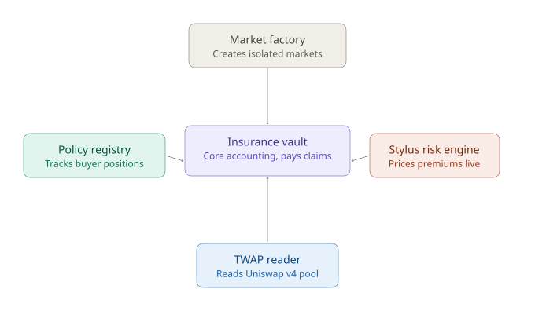

# PRD: On-Chain Rug-Pull Insurance Protocol

**Codename:** RugGuard (placeholder — rename freely)
**Chain:** Robinhood Chain (Arbitrum Orbit) — deployable to Arbitrum One / Arbitrum Sepolia as fallback
**Hackathon:** Arbitrum Open House Singapore — Online Buildathon
**Status:** Draft v1

---

## 1. Problem Statement

Memecoin trading dominates Robinhood Chain activity (~79% of DEX volume, $217M+ in stock-paired meme pairs alone). Rug pulls — sudden liquidity removal or malicious contract actions that crash a token's price — are a well-documented, industrialized threat in this market (CryptoSlate, Elliptic, and multiple 2026 incident reports confirm this).

Existing tools (RugCheck, Veritas Protocol, Elliptic, ScanHood, GeckoTerminal Rug Checker) only **detect and warn** before the fact. None of them **compensate** a trader who gets rugged anyway. Existing crypto insurance protocols (Nexus Mutual, InsurAce, Cork Protocol) explicitly exclude "market losses" / ordinary price volatility from coverage — and for good reason, covered in Section 4.

**Gap:** no live, working protocol offers purchasable, automatically-settled protection against rug-pull-style crashes specifically, isolated per-token, on a permissionless basis. (Closest attempt found — "Rugsafe" — is an unreviewed academic paper explicitly flagged by reviewers as non-functional, with a fatal design flaw around atomic-transaction liquidity drains.)

---

## 2. Target Users

| User                 | Who they are                                                                        | What they want                                                                                                                |
| -------------------- | ----------------------------------------------------------------------------------- | ----------------------------------------------------------------------------------------------------------------------------- |
| **Buyer (trader)**   | Retail memecoin trader on Robinhood Chain, already holds/is buying a specific token | Cheap, automatic protection against catastrophic loss from a rug pull — without needing to trust a centralized claims process |
| **LP (underwriter)** | Holder of idle USDC/USDG, comfortable taking on defined, isolated risk for yield    | Yield higher than passive lending (Aave-style 4–6%), with control over which token and risk profile they underwrite           |

---

## 3. Core Design Decisions (and why)

These are the load-bearing decisions from extensive validation — each one exists because a simpler version was tried and broke.

### 3.1 Trigger: price-based, not event-based

- **Rejected:** "price drops X% in 24h" — this fires on nearly every trending memecoin's normal pump-and-dump cycle, not just rugs. Bankrupts the pool in days.
- **Rejected:** "on-chain malicious event detected" (LP removal, mint abuse) — this duplicates what scanners (RugCheck etc.) already do for free, weakening the product's reason to exist.
- **Chosen:** **severity + time-window** — a crash counts only if it's both steep AND fast (e.g., "price falls ≥85% within ≤10 minutes"). This is statistically rare enough to be insurable, distinct from ordinary volatility, and doesn't overlap with contract-scanning tools.

### 3.2 Oracle: native Uniswap V4 TWAP, no external oracle

Memecoins on Robinhood Chain graduate into Uniswap V4 pools (via Pons/Pools.trade hooks) on a shared PoolManager. V4 pools expose native price history — we read TWAP directly from the pool instead of relying on an external oracle (e.g., Chainlink), removing a dependency and an attack surface.

### 3.3 Single-sided LP, isolated per-token markets

- LPs deposit **only USDC/USDG** — never the volatile token itself.
- Every token gets its **own isolated market** (paste contract address → market auto-created if it doesn't exist, permissionless, à la Morpho Blue / Meteora pool creation). A rug on Token A never touches LPs underwriting Token B.

### 3.4 LP-defined risk parameters (not fixed tiers)

LPs set their own **severity %** and **time window** per position (two independent sliders — not a single price range like Uniswap/DLMM, because severity and speed are two separate axes, not one). Estimated APY is computed and shown live based on the token's historical volatility.

### 3.5 Insurable interest requirement

A buyer can only purchase protection for a token they demonstrably hold (wallet balance check at purchase time). This is a deliberate legal/design choice: it keeps the product closer to insurance (compensating a real position) than to a pure directional bet, which matters given gambling-regulation exposure in multiple jurisdictions.

### 3.6 Extra Consideration: USDG Integration

All premiums, LP deposits, and payouts are denominated in **Paxos USDG**, aligning with the hackathon's stated bonus criterion.

---

## 4. Anti-Manipulation Safeguards (defense in depth, not a single silver bullet)

| Layer                          | Mechanism                                                                                                                              | Stops                                                   |
| ------------------------------ | -------------------------------------------------------------------------------------------------------------------------------------- | ------------------------------------------------------- |
| 1. Self-dealing check          | At claim time, contract checks whether the claiming wallet was a major seller during the crash window. If so, claim is rejected.       | Buyer manufacturing their own crash to trigger a payout |
| 2. Payout cap vs. pool depth   | Max payout per policy is capped below the estimated cost of manipulating that token's price by the trigger severity in its actual pool | Makes manipulation unprofitable even if attempted       |
| 3. Minimum liquidity threshold | Tokens below a TVL floor are not insurable                                                                                             | Prevents thin pools being trivially manipulated         |

**Open risk, stated honestly:** the severity/window trigger values are illustrative, not yet calibrated against real historical crash data from Robinhood Chain tokens. This calibration is a stated post-hackathon milestone, not something claimed as solved today.

---

## 5. User Flows

### LP flow

1. Paste token contract address (or browse trending tokens)
2. If no market exists → auto-create one; risk score computed from on-chain signals (volatility, liquidity depth)
3. Set severity % and time window (two sliders) → live APY estimate shown
4. Deposit USDC/USDG → position is live, earns share of premiums for that market
5. Withdraw anytime (subject to funds not locked backing an active unexpired policy)

### Buyer flow

1. Paste token contract address they hold
2. If a market with available capacity exists → see premium quote(s) for available severity/window combinations
3. If no LP capacity exists → clear message: "No protection available for this token yet"
4. Pay premium (USDG) → policy active for chosen duration
5. If trigger condition is met (TWAP-confirmed) → automatic payout, no manual claim
6. If not triggered by expiry → premium is forfeited (LP yield)

---

## 6. Protocol Roles

- **LP (underwriter)** — deposits USDG into a specific token's isolated vault, sets their own severity % and time-window threshold. Earns premiums as yield, bears claim payouts as risk.
- **Buyer (trader)** — must hold the token being insured (insurable-interest check), pays a premium sized by real-time volatility, receives automatic payout if the trigger fires.
- **Keeper** — permissionless role that checks TWAP conditions and calls settlement when a trigger threshold is crossed. Anyone can run this; it is not a privileged/trusted role.
- **Uniswap V4 pool** — external, read-only price source. The vault never deposits into it — it only reads TWAP data from the pool the token already trades on.

---

## 7. Protocol Design

- **Market factory** — entry point. A user pastes a token contract address; if no market exists for that token yet, the factory permissionlessly deploys a new isolated `InsuranceVault` for it.
- **Insurance vault** — the core per-token contract. Holds LP deposits (USDG), executes payouts to buyers when the trigger condition is met, and runs the anti-manipulation safeguards (self-dealing check, payout cap).
- **Policy registry** — tracks who currently holds active protection for a given token, including the insurable-interest check (buyer wallet balance verification) and policy expiry.
- **Stylus risk engine** — the Rust/Stylus component that computes real-time volatility from TWAP data and prices premiums dynamically for whatever severity/window combination an LP or buyer selects.
- **TWAP reader** — reads price history directly from the token's own Uniswap V4 pool (no external oracle), giving the keeper the data needed to evaluate whether a trigger condition has been met.

**Contracts (Solidity, Arbitrum/Robinhood Chain):**

- `MarketFactory.sol` — permissionless per-token market creation
- `InsuranceVault.sol` — single-sided USDG deposits, position accounting, payout execution, self-dealing + payout-cap checks
- `PolicyRegistry.sol` — active policy tracking, insurable-interest verification, expiry handling
- `TWAPReader.sol` — reads price history directly from the token's Uniswap V4 pool

**Compute layer (Stylus/Rust):**

- Real-time volatility scoring per token (rolling standard deviation)
- Dynamic premium/APY calculation from volatility + chosen severity/window

---

## 8. Judging Criteria Alignment

| Criterion                     | How this product addresses it                                                                                                                                                           |
| ----------------------------- | --------------------------------------------------------------------------------------------------------------------------------------------------------------------------------------- |
| Smart contract quality        | Isolated per-market accounting, checks-effects-interactions, invariant: payout never exceeds vault balance for that market                                                              |
| Product-Market Fit            | Direct user base = the ~79% of Robinhood Chain DEX volume that is memecoin trading; documented, unmet demand for post-hoc protection (not just pre-trade scanning)                      |
| Innovation & Creativity       | Combines proven primitives (options-vault architecture, permissionless market creation, native V4 TWAP) into a category — payout insurance for rug pulls — that does not yet exist live |
| Real Problem Solving          | Rug pulls are a documented, industrialized problem (Elliptic, CryptoSlate 2026 reporting); existing tools only warn, never compensate                                                   |
| USDG bonus                    | All value flows (premiums, deposits, payouts) denominated in USDG                                                                                                                       |
| Robinhood Chain reserved slot | Deployed natively where the target user base and Uniswap V4 memecoin infrastructure already exist                                                                                       |

---

## 9. MVP Scope (Hackathon)

**In scope:**

- Single isolated market creation flow (paste CA)
- LP deposit with severity/window selection, live APY estimate
- Buyer purchase flow with insurable-interest check
- TWAP-based trigger detection (fixed polling or keeper-triggered check, not necessarily real-time push)
- Self-dealing check + payout cap safeguard
- Basic frontend for both flows
- Deployment + demo on Robinhood Chain testnet (and/or Arbitrum Sepolia)

**Out of scope (post-hackathon roadmap):**

- Stylus-based real-time volatility engine (Solidity approximation acceptable for MVP; Stylus version as stated next milestone)
- Historical-data calibration of trigger thresholds
- Cross-market LP diversification / auto-index products
- Mainnet launch, formal audit

---

## 10. Known Open Risks (stated honestly, not hidden)

1. **Cold-start liquidity:** unproven whether LPs will actually provide capital at meaningful scale before real usage data exists. Mitigated for demo purposes via seeded/simulated liquidity; real-world bootstrapping is a genuine post-hackathon challenge.
2. **Trigger calibration:** severity/window values are illustrative pending real historical volatility analysis.
3. **Scope discipline:** full vision (Stylus engine, multi-market UX polish) exceeds a solo 2.5-week build; MVP above is the honest, achievable cut.

---

## 11. Milestones (for Grant Consideration)

- **M1 (hackathon submission):** MVP as scoped in Section 8, deployed to testnet, demo video
- **M2 (+1 month):** Trigger threshold calibration using real Robinhood Chain historical data; Stylus volatility engine integration
- **M3 (mainnet):** Security review, mainnet launch on Robinhood Chain, initial LP bootstrapping program
